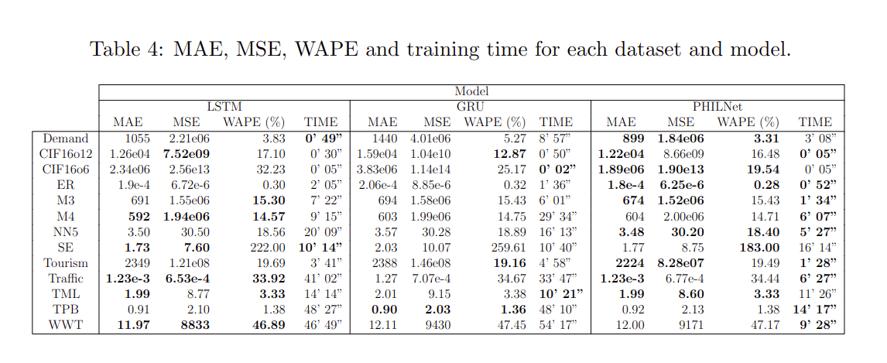

# Time Series Forecasting with Deep Learning
[](https://github.com/tensorflow/tensorflow/releases/tag/v2.2.0)
[](https://github.com/tensorflow/addons/releases)
[](https://www.python.org/downloads/release/python-380/)

This repository is a modified version from this [repository](https://github.com/pedrolarben/TimeSeriesForecasting-DeepLearning).

PHILNet: A Novel Efficient Approach for Time Series Forecasting using Deep Learning

> Time series is one of the most common data types in the industry nowadays. Forecasting the future of a time series behavior can be useful to plan ahead, save time, resources, and help avoid undesired scenarios. To make the forecasting, historical data is utilized due to the causal nature of the time series. Several deep learning algorithms have been presented in this area, where the input is processed through a series of nonlinear functions to produce the output.  We present a novel strategy to improve the performance of deep learning models in time series forecasting in terms of efficiency while reaching similar effectiveness. This approach separates the model into levels, starting with the easiest and continuing to the most difficult. The simpler levels deal with smoothed versions of the input, whereas the most sophisticated level deals with the raw data. This strategy seeks to mimic the human learning process, in which basic tasks are completed initially, followed by more precise and sophisticated ones. Our method achieved promising results and outperformed LSTM and GRU models in a variety of time series.

## Usage

Step 1: Download and preprocess data.

``` python generate_data.py ```

Step 2: Execute the comparison.

```./run.sh ```

## Data

Original data can be found using this [link](https://drive.google.com/drive/folders/1E4gdkBjIi89ZS_cT8C8yZmrjlM-_k5A7?usp=sharing)

## Results



## Authors <a name="authors"></a>

* **Manuel Jesús Jiménez Navarro** 
* **María Martínez Ballesteros** 
* **Francisco Martínez Álvarez** 
* **Gualberto Asencio Cortés**

## License<a name="license"></a>

This project is licensed under the MIT License - see the [LICENSE.md](LICENSE.md) file for details.
